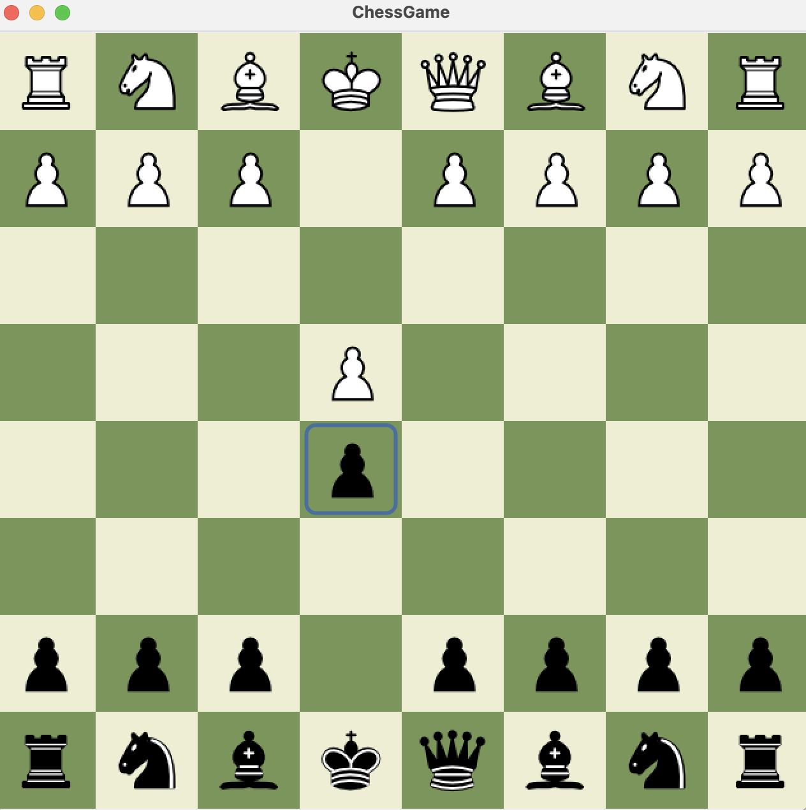
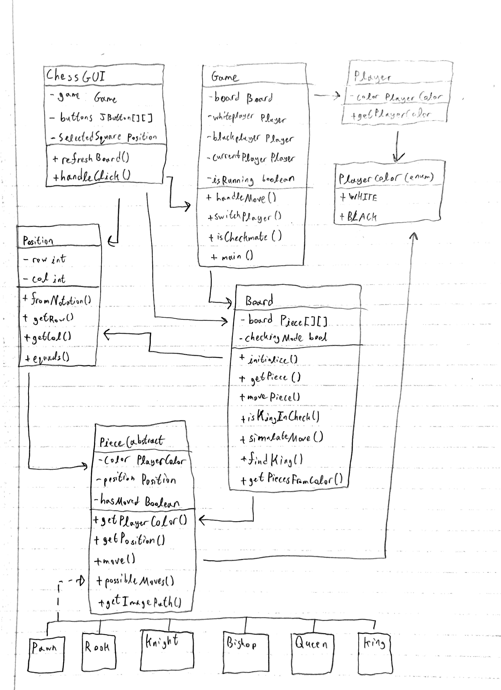

Team members: Muhammad El-Zein

Semester: Fall 2025
Course Number: 3354
Section Number: 001

GUI:

Class Diagram:

How to Compile, Start, and Run the Game:
    Compile the game by runing "javac */*.java" while in the ChessProject folder, then start the game by running "java game.Game". 

Achieved Features:
    The chess game includes all pieces with correct movement rules and some special cases, such aas pawn double move and check prevention. The game enforces move validation, detects check and checkmate, and gives a game over screen when checkmate occurs.

